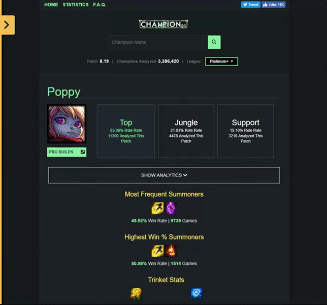
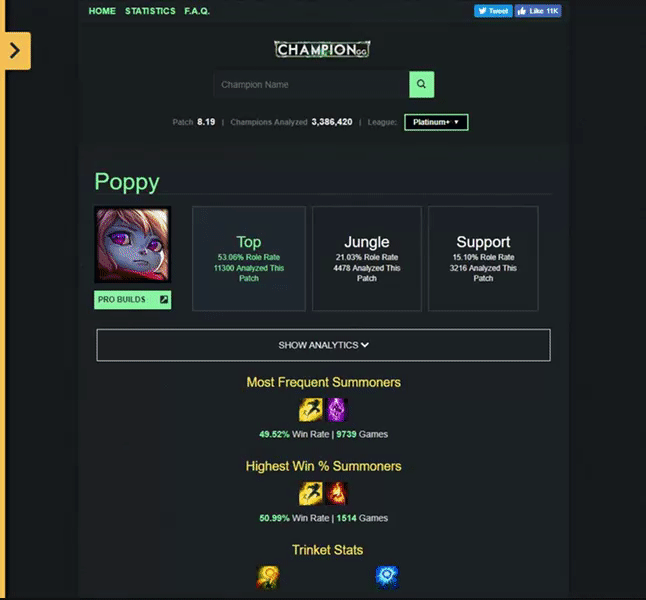
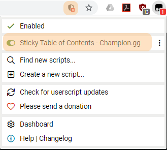

# Sticky Table of Contents for Champion.gg

A script to add a sticky table of contents for champion pages on champion.gg to organize champion info and improve usability and readability.

## Overview

I occasionally use Champion.gg for quick info when I'm playing League of Legends. I find the site informative but overwhelming to use, especially in the time constraints of champ select, so I made a script that fixes some UX pain points.

#### Table of Contents

* Built a slide panel and generated a sticky table of contents based on the headings to provide easy skip-to-content anchors.
* Sorted the items based on info relevant information for each step heading into a match.

#### Interactive / Navigational element tweaks

* Made a minimal sticky header to ensure Champion Search and League Filter is always accessible.
* Revamped the champion profile area. Mainly the role select area and pro builds link.
* Added a back to top button.

#### Chunking Content

The flow of content and mark up is a bit weird to say the least but I tried to make it concise for my purposes.

* Forced a smaller width layout
* Hid analytics under a toggle.
* Order of content isn't how the ToC is listed, but did the bare minimum of moving elements around to have related information closer in proximity.

## Usage

Made and tested only using Chrome.

* Add [Tampermonkey](https://tampermonkey.net/) add on to Chrome
* Go to dashboard, add a new script and paste contents of stoc.v#.js
* Visit a champion page on champion.gg and enable the script. (Might need to allow scripts to load if chrome blocks it.)

## Log

* 09.30.2018 - Release - [stoc.v1.js](stoc.v1.js)
